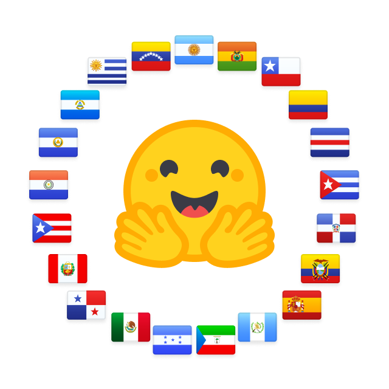

# IberoTales
<em>Alineando modelos de lenguaje con la narrativa de mitos y leyendas de Iberoamérica.</em> 

## Índice
- [Descripción del Proyecto](#descripción-del-proyecto)
- [Objetivos](#objetivos)
- [Estructura del Proyecto](#estructura-del-proyecto)
- [Casos de Uso](#casos-de-uso)
- [Datasets](#datasets)
- [Modelo](#modelo)
- [Demo](#demo)

## Descripción del Proyecto
IberoTales es un proyecto que busca alinear el storytelling en modelos de lenguaje con el patrimonio cultural de Iberoamérica. El enfoque se centra en la recopilación y preservación de mitos y leyendas tradicionales, tanto de transmisión oral como escrita, para entrenar modelos de lenguaje especializados en narrativa que reflejen auténticamente el patrimonio cultural, simbólico y espiritual de las diferentes regiones iberoamericanas.

## Objetivos
- Recopilar y digitalizar mitos y leyendas tradicionales de Iberoamérica
- Crear un corpus estructurado de narrativas culturales
- Entrenar modelos de lenguaje especializados en storytelling cultural
- Preservar el patrimonio narrativo frente al olvido
- Promover la difusión de estas historias a través de tecnologías emergentes
- Facilitar la representación cultural en sistemas de IA

## Casos de Uso
- Alineamiento de modelos de lenguaje con narrativas culturales
- Generación de historias basadas en tradiciones iberoamericanas
- Difusión cultural a través de tecnologías de IA
- Investigación en storytelling cultural y preservación digital

## Datasets
- [`ibero-tales-es`](https://huggingface.co/datasets/somosnlp-hackathon-2025/ibero-tales-es): Mitos y leyendas sintéticos de Iberoamérica en español, curadas y estructuradas para entrenamiento de modelos de lenguaje.
- [`ibero-characters-es`](https://huggingface.co/datasets/somosnlp-hackathon-2025/ibero-characters-es): Dataset de personajes míticos y legendarios de diferentes paises, con descripciones e historia original.

## Modelo
- [`iberotales-gemma-3-1b-it-es`](https://huggingface.co/somosnlp-hackathon-2025/iberotales-gemma-3-1b-it-es): Modelo de lenguaje alineado para generación de historias y narrativa iberoamericana, entrenado sobre los datasets anteriores.

## Demo
- [Demo interactiva en Hugging Face Spaces](https://huggingface.co/spaces/somosnlp-hackathon-2025/IberoTales): Prueba el modelo directamente desde tu navegador y genera historias o explora personajes de Iberoamérica.

*Nota: Aunque el enfoque principal del proyecto está en la recopilación textual y el alineamiento de un LLM, no se descarta que pueda ampliarse a recursos multimodales (pares texto-imagen) para enriquecer la comprensión contextual y visual de estas tradiciones.*

---

  <em>Este proyecto fue parte de la hackathon de Somos NLP 2025.</em> 
  

